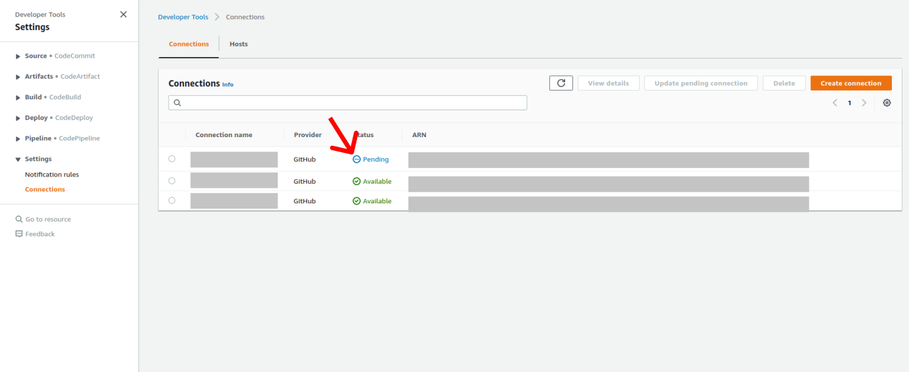

# MBC

[](README.md)
[](README_ja.md)

ソースファイルの構成は以下の通り。

- docsファイル - ドキュメントファイル

- infraファイル - インフラのコード

- srcファイル - Lambdaのコードファイル

- testファイル - テスト用のファイル
 
## 新規アカウントへの初期のデプロイ手順
 
前提条件として、新規アカウントが下記の相対パスの資料に記載の通り、AWSのPolicies
を設定する必要がある。
infra/sam_mbc/iam_policies.json
 
## 環境設計
下記のものをインストールを実行する。

- git

- python 3.9

- pip

- vscode

- docker [Install Docker community edition](https://hub.docker.com/search/?type=edition&offering=community)

- SAM CLI [Install the SAM CLI](https://docs.aws.amazon.com/serverless-application-model/latest/developerguide/serverless-sam-cli-install.html)
 
## 新規のアカウントへのデプロイ手順
 
まずは、下記のCLIを実行する。

```bash
$ cd infra/sam_mbc  テンプレートファイルを含むフォルダに行く

$ sam build -t template.yaml　ドッカーイメージ作成、作成されたドッカーイメージにLambdaコードを移動させる。

$ sam deploy --profile <AWS認証のため、こちらに初期アカウントのプロファイルを指定する。> -g ドッカーイメージをパッケージし、指定されたAccountにデプロイする。

```
 
下記のプロンプトが表示される。

- **Stack Name**: CloudFormationのデプロイ先のスタック名

- **System Name**：システム名

- **Env** 環境種類を指定する。選択しはdev（開発環境）, stg（ステージング環境）, prod（プロダクション環境）

- **RetentionInDays** Log保持期間を指定する （最大180日）

- **ReadCapacityUnits** 読み取りキャパシティ容量を指定する （ディフォルト = 5）

- **WriteCapacityUnits** 書き込みキャパシティ容量を指定する（ディフォルト = 5）

- **BatchSite** DynamoDBからSNSへストリーム容量を指定する（ディフォルト = 1）

- **GithubOwner** リポジトリの使用者のユーザ名を入力する（必須）

- **GithubRepo** リポジトリ名を入力する（必須）

- **GithubBranch** デプロイブランチを指定する（必須）（ディフォルト = main）

- **ConnectionId**　code Star connection用のIDを指定する

指定しない場合、システムがAWS上に自動的にPending状態のConnectionを作成する。そのConnectionをActiveにする必要がある。手順は以下の通り。

①にアクセスする。

②左側のパネルにある「Setting]をタップする。

③Pending状態のConnectionが表示される。＝＞ 画面の指示に従って

Connection　Updateを実行する。



- **BuildSpecFilePath** Buildspecファイルのパスを指定　（必須）（Default　＝　buildspec.yaml）  

下記のプロンプトはデフォルトの値で進めても大丈夫である。

- **AWS Region**

- **Confirm changes before deploy**

- **Allow SAM CLI IAM role creation**

- **Save arguments to samconfig.toml**
 
全ての上記のものを指定したら、デプロイが開始される。（３，４分ぐらいかかる）
API Gateway Endpoint URLはデプロイ結果として画面に表示される。

## リソースについて
 
SAMの詳細については下記のリンクにご参照ください。
[AWS SAM developer guide](https://docs.aws.amazon.com/serverless-application-model/latest/developerguide/what-is-sam.html) for an introduction to SAM specification, the SAM CLI, and serverless application concepts.
 
## Codebuild/Codepipelineについて

継続的インテグレーションおよび継続的デプロイ (CI/CD) パイプラインの詳細については以下のリンクに参照ください。

- About [Codebuild](https://aws.amazon.com/codebuild/)

- About [Codepipeline](https://aws.amazon.com/codepipeline/)
 
## CI Tooling (Buildspecs)について

buildspecsのフォルダは以下のファイルが含まれる。
 
src/buildspec.yaml: Build the docker images
 
## デプロイ結果として、Test用のMockupDatabaseを作成させたい場合は以下のCLIを実行する。
 
```bash
$ cd infra/sam_mbc 

$ sam build -t template_db.yaml 

$ sam deploy --profile <AWS認証のため、こちらに初期アカウントのプロファイルを指定する。> -g 

```
