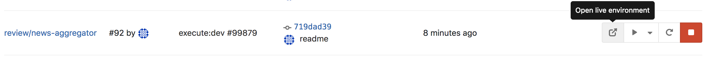
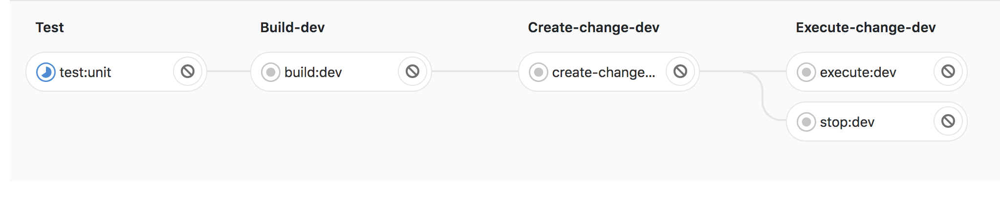
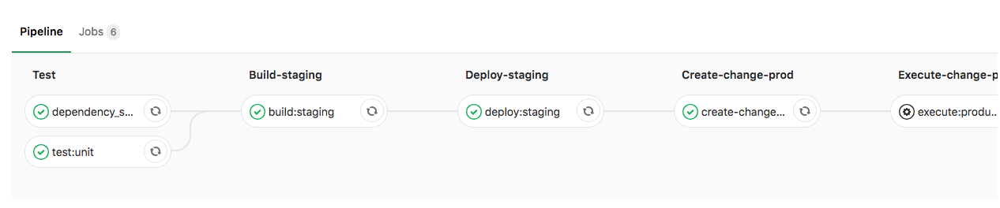
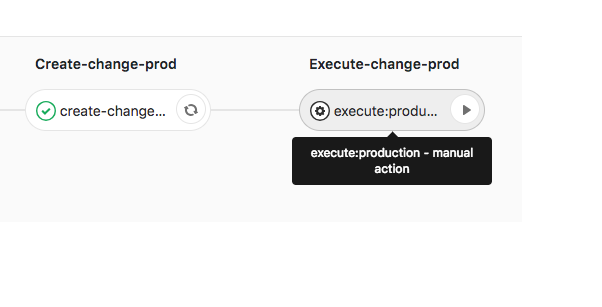

# AWS SAM + GitLab CI

## Overview

This project has two purposes.

First, it's a reference to demonstrate best practices at the intersection of two powerful technologies: GitLab CI and AWS SAM (the Serverless Application Model). We've created a `gitlab-ci.yml` file that uses multi-account AWS deployments, a branch-based environment lifecycle, and much more -- all integrated with SAM deployments.

Second, it includes an example SAM application, an AWS News curator that actually works. You can read all about that project and deploy it yourself from the {{cookiecutter.project_name}} folder.

## What's SAM?

[AWS SAM](https://docs.aws.amazon.com/serverless-application-model/latest/developerguide/what-is-sam.html), at the highest level, is an [open source framework](https://github.com/awslabs/serverless-application-model) for building serverless applications on AWS. You can think of it as an extension to CloudFormation that makes it easier to define and deploy AWS resources -- such as Lambda functions, API Gateway APIs and DynamoDB tables -- commonly used in serverless applications. 

In addition to its templating capabilities, SAM also includes a CLI for testing and deployment, though some of the CLI commands are just aliases to underlying CloudFormation calls. In this project, we used the AWS CloudFormation CLI to build and deploy our SAM application.

We've included a sample SAM application called "AWS News" in the {{cookiecutter.project_name}} folder, but you can use the `.gitlab-ci.yml` file at the top of this repo with any SAM application.

## GitLab CI Template Walkthrough

After working through the "AWS News" tutorial, or creating a SAM template of your own, you'll have a serverless application defined on your local machine. But that's only half the battle; we now have to get that code into the cloud. We used [Gitlab CI](https://about.gitlab.com/product/continuous-integration/), a CI/CD pipeline model integrated with the [GitLab](https://about.gitlab.com/) source control system, for this purpose.

Our pipeline configuration, which lays out the steps necessary to automatically build, test and deploy our code in the appropriate AWS environment(s), is defined in the `.gitlab-ci.yml` file at the top level of this repository. GitLab CI is smart enough to dynamically create and execute the pipeline based on that template when we push code to GitLab.

### Inputs
We've defined a number of variables at the top of our `.gitlab-ci.yml` file:

```yaml
  PROD_ACCOUNT: "012345678901" #12-digit account ID for your production AWS environment
  STAGING_ACCOUNT: "098765432123" #12-digit account ID for your staging AWS environment
  DEV_ACCOUNT: "123456789012" #12-digit account ID for your dev AWS environment
  DEV_REGION: us-east-2 #Deployment AWS region for your development environment
  STAGING_REGION: us-east-2 #Deployment AWS region for your staging environment
  PROD_REGION: us-east-2 #Deployment AWS region for your production environment
  CI_ROLE_NAME: gitlab-ci-deployment #'SharedServiceRoleName' output from deployed setup-templates/roles.yml
  DEPLOYMENT_ROLE_NAME: gitlab-ci-passed-role #'SharedDeploymentRoleName' output from deployed x-account-roles/roles.yml
  CI_BUCKET: my-ci-bucket #'ArtifactBucket' output from deployed setup-templates/ci-bucket.yml
  DEV_HOSTED_ZONE_NAME: dev.mycompany.com #OPTIONAL - only needed if you want a DNS name for your review apps. Don't include trailing dot
  STAGING_HOSTED_ZONE_NAME: staging.mycompany.com #OPTIONAL - only needed if you want a DNS name for your review apps. Don't include trailing dot
  PROD_HOSTED_ZONE_NAME: prod.mycompany.com #OPTIONAL - only needed if you want a DNS name for your review apps. Don't include trailing dot
  DEV_ACM_CERT_ID: asdfg12-sdfa-asdf-1234-0a2b3c4f5gasdf #OPTIONAL - only needed if you want a DNS name for your review apps.
  STAGING_ACM_CERT_ID: asdfg12-sdfa-asdf-1234-0a2b3c4f5gasdf #OPTIONAL - only needed if you want a DNS name for your review apps.
  PROD_ACM_CERT_ID: asdfg12-sdfa-asdf-1234-0a2b3c4f5gasdf #OPTIONAL - only needed if you want a DNS name for your review apps.
  SES_SENDER_ADDRESS: email@mycompany.com #Email address to send weekly emails from
  image: lambci/lambda #Docker image to use for build jobs - should have Python 3 installed
```

Most of these variables (such as account, region, and S3 bucket) occur in sets of three, with separate values for your development, staging, and production environment. You should replace these values with appropriate ones for your environments according to the inline comments above.

Below the variables section, you'll notice three sets of YAML anchors/aliases called `dev_variables`, `staging_variables`, and `prod_variables`. Theses sections will let us refer to groups of related variables later on without having to specify each one individually.

### Stages

Our Gitlab CI pipeline contains seven possible stages, defined as follows:

```yaml
stages:
  - test
  - build-dev
  - deploy-dev
  - build-staging
  - deploy-staging
  - create-change-prod
  - execute-change-prod
```

"Stages" are used as a control flow mechanism when building the pipeline. Multiple build jobs within a stage will run in parallel, but all jobs in a given stage must complete before any jobs belonging to the next stage in the list can be executed.

Although ten stages are defined here, only certain ones will execute depending on what kind of Git action triggered our pipeline. We effectively have three stages to any deployment: a "test" phase where we run unit tests and dependency scans against our code, a "build" phase that packages our SAM template, and a "deploy" phase split into two parts: creating a [CloudFormation change set](https://docs.aws.amazon.com/AWSCloudFormation/latest/UserGuide/using-cfn-updating-stacks-changesets.html) and then executing that change set in the target environment.

#### Test
Our `.gitlab-ci.yml` file currently runs two types of tests: unit tests against our code, and dependency scans against our third-party Python packages.

##### Unit Tests

Unit tests run on every branch pushed to the remote repository. This behavior is defined by the `only: branches` property in the job shown below:

```yaml
test:unit:
  stage: test
  only:
    - branches
  script: |
    if test -f package.json; then
      npm install --loglevel error;
      npm run test;
    elif test -f requirements.txt; then
        pip install -r requirements.txt
        python -m pytest --ignore=functions/
    elif test -f pom.xml; then
        mvn verify
    else
      echo "no test file found to run tests from";
    fi
```

Every GitLab CI job runs a script. Here, we install any dependencies, then execute Python unit tests in `test.py`. We've also provided example test invocations for Javascript and Java.

##### Dependency Scans
[Dependency scans](https://docs.gitlab.com/ee/user/project/merge_requests/dependency_scanning.html), which can take a few minutes, run only on code pushed to the master branch; it would be counterproductive for developers to wait on them every time they want to test code.

```yaml
dependency_scanning:
  stage: test
  image: docker:stable
  only:
    - master
  variables:
    DOCKER_DRIVER: overlay2
  allow_failure: true
  services:
    - docker:stable-dind
  script:
    - export SP_VERSION=$(echo "$CI_SERVER_VERSION" | sed 's/^\([0-9]*\)\.\([0-9]*\).*/\1-\2-stable/')
    - echo $PWD
    - docker run
        --env DEP_SCAN_DISABLE_REMOTE_CHECKS="${DEP_SCAN_DISABLE_REMOTE_CHECKS:-false}"
        --volume "$PWD:/code"
        --volume /var/run/docker.sock:/var/run/docker.sock
        "registry.gitlab.com/gitlab-org/security-products/dependency-scanning:$SP_VERSION" .
  artifacts:
    paths: [gl-dependency-scanning-report.json]
```

These scans use a hardcoded, standard Docker image to mount the code and run "Docker in Docker" checks against a database of known package vulnerabilities. If a vulnerability is found, the pipeline will log the error without stopping the build (that's what the `allow-failure: true` property does).

#### Build

The build stage turns our SAM template into CloudFormation and turns our Python code into a valid AWS Lambda deployment package. For example, here's the `build:dev` job:

```yaml
build:dev:
  stage: build-dev
  <<: *build_script
  variables:
    <<: *dev_variables
  artifacts:
    paths:
      - deployment.yml
    expire_in: 1 week
  only:
    - branches
  except:
    - master
```

What's going on here? Note first the combination of `only` and `except` properties to ensure that our development builds happen only on pushes to branches that aren't `master`. We're referring to `dev_variables`, the set of development-specific variables we defined earlier. And we're running a script, pointed to by `build_script`, which packages our SAM template and code for deployment using the `aws cloudformation package` CLI call.

The artifact `deployment.yml` is the CloudFormation template output by our package command. It has all the implicit SAM magic expanded into CloudFormation resources. By managing it as an artifact, we can pass it along to further steps in the build pipeline, even though it isn't committed to our repository.

#### Deploy
Our deployments use AWS CloudFormation to deploy the packaged application in a target AWS environment.

In development and staging environments, we use the `aws cloudformation deploy` command to create a change set and immediately execute it. In production, we put a manual "wait" in the pipeline at this point so you have the opportunity to review the change set before moving on to the "Execute" step, which actually cals `aws cloudformation execute-changeset` to update the underlying stack.

Our deployment jobs use a helper script, committed to the top level of this repository, called `cfn-wait.sh`. This script is needed because the `aws cloudformation execute-changeset` command doesn't wait for results. It reports success as soon as the stack deployment starts. To properly record the deployment results in our job, we need a script that polls the CloudFormation service and throws an error if the deployment or update fails.

### Review Apps
If we are dynamically deploying our application on every branch push, we might like to view it as part of our interaction with the GitLab console (such as during a code review). GitLab supports this with a nifty feature called [Review Apps](https://docs.gitlab.com/ee/ci/review_apps/). Review Apps allow you to specify an "environment" as part of a deployment job, as seen in our `deploy:dev` job below:

```yaml
deploy:dev:
  <<: *deploy_script
  stage: deploy-dev
  dependencies: 
    - build:dev
  variables:
    <<: *dev_variables
  environment:
    name: review/$CI_COMMIT_REF_NAME
    url: https://${CI_COMMIT_REF_NAME}.${DEV_HOSTED_ZONE_NAME}/services
    on_stop: stop:dev
  only:
    - branches
  except:
    - master
```

The link specified in the `url` field of the `environment` property will be accessible in the `Environments` section of GitLab CI or on any merge request of the associated branch. (In our specific case, since we don't have a front end to view, the link just takes you to a GET request for the `/services` API endpoint and should display some raw JSON in your browser.)



The `on_stop` property specifies what happens when you "shut down" the environment in GitLab CI. This can be done manually or by deleting the associated branch. In the case above, we have stop behavior for dev environments linked to a separate job called `stop:dev`:

```yaml
stop:dev:
  stage: deploy-dev
  variables:
    GIT_STRATEGY: none
    <<: *dev_variables
  <<: *shutdown_script
  when: manual
  environment:
    name: review/$CI_COMMIT_REF_NAME
    action: stop
  only:
    - branches
  except:
    - master
```

This job launches the `shutdown_script` script, which calls `aws cloudformation teardown` to clean up the SAM deployment.

For safety's sake, there is no automated teardown of staging or production environments.

## Deployment Flow

The control statements (`only`, `when`, `except`) on the various build jobs lead to different pipeline configurations depending on what activity triggers the pipeline. Let's look at the possible scenarios below.

### Push Commit to Branch (Non-Master)



When a non-master branch is pushed to the remote, the piepline runs tests, builds the updated source code, and deploys and/or updates the changed CloudFormation resources in the development AWS account. When the branch is merged into master, or if someone clicks the "Stop" button next to the branch's environment in GitLab CI, the CloudFormation stack will be torn down automatically.

It is perfectly possible, and indeed desirable, to have multiple development feature branches simultaneously deployed as live environments for more efficient parallel feature development and QA. The serverless model makes this a cost-effective strategy for collaborating in the cloud.

### Push Commit to Master Branch



When a change is merged into the master branch, the code is built, tested (including dependency scans) and deployed to the staging environment. This is a separate, stable environment that developers, QA, and others can use to verify changes before attempting to deploy in production.

### Manually approve Production Change Set



After deploying code to the staging environment, the pipeline will create a change set for the production stack, and then pause for a manual intervention. A human user must click a button in the Gitlab CI "Environments" view to execute the final change set.

## Cross-Account Security

Because the setup described above involves multiple AWS accounts, it is necessary to work with cross-account IAM roles in order to authorize deployments. Our setup handles this task through the following steps.

1. Deploy `setup-templates/roles.yml` in development, staging, and production accounts

This CloudFormation template defines two roles: `SharedServiceRole` and `SharedDeploymentRole`. The `SharedServiceRole` is assumed by the GitLab CI runner when calling the AWS CloudFormation service. This role trusts the GitLab CI runner's role. It has fairly limited permissions. 

The `SharedDeploymentRole`, on the other hand, has full administrative access to perform any AWS action. A such, it cannot be assumed directly by the GitLab CI runner. Instead, this role must be "passed" to CloudFormation using the service's `RoleArn` parameter. The CloudFormation service trusts the `SharedDeploymentRole` and can use it to deploy whatever resources are needed as part of the pipeline.

2. Deploy `setup-templates/ci-bucket.yml` in the account where your GitLab CI Runner exists

This CloudFormation template creates a centralized S3 bucket which holds the artifacts created during your pipeline run. Artifacts are created once for each branch push and reused between staging and production. The bucket policy allows the development, test, and production accounts to reference these artifacts when deploying CloudFormation stacks.

3. Assume the `SharedServiceRole` before making any cross-account AWS calls
We have provided the script `assume-role.sh`, shown below:

```bash
REGION=$1
TAG=$2
ROLE=$3

echo "===== checking for tag and presence in master branch ====="
([ -z $TAG ] || (git branch -r --contains `git rev-list -n 1 $TAG` | grep master))
echo "===== assuming permissions => $ROLE ====="
KST=(`aws sts assume-role --role-arn $ROLE --role-session-name "deployment-$TAG" --query '[Credentials.AccessKeyId,Credentials.SecretAccessKey,Credentials.SessionToken]' --output text`)
unset AWS_SECURITY_TOKEN
export AWS_DEFAULT_REGION=$REGION
export AWS_ACCESS_KEY_ID=${KST[0]}
export AWS_SECRET_ACCESS_KEY=${KST[1]}
export AWS_SESSION_TOKEN=${KST[2]}
export AWS_SECURITY_TOKEN=${KST[2]}
```
This script will assume the provided role and export temporary AWS credentials to the current shell. It is sourced in the various `.gitlab-ci.yml` build scripts.

## Further Reading
We have barely scratched the surface of GitLab CI and AWS SAM in this tutorial. Here are some interesting readings if you would like to take your work to the next level:

### SAM
- [Implementing safe AWS Lambda deployments with AWS SAM and CodeDeploy](https://aws.amazon.com/blogs/compute/implementing-safe-aws-lambda-deployments-with-aws-codedeploy/)
- [Running and debugging serverless applications locally using the AWS SAM CLI](https://github.com/awslabs/aws-sam-cli/blob/develop/docs/running_and_debugging_serverless_applications_locally.rst)

### GitLab CI
- [Setting Up a GitLab Runner on EC2](https://hackernoon.com/configuring-gitlab-ci-on-aws-ec2-using-docker-7c359d513a46)
- [Scheduled Pipelines](https://docs.gitlab.com/ee/user/project/pipelines/schedules.html)
- [ChatOps](https://docs.gitlab.com/ee/ci/chatops/README.html)

Please [let Trek10 know](https://www.trek10.com) if you have further questions!