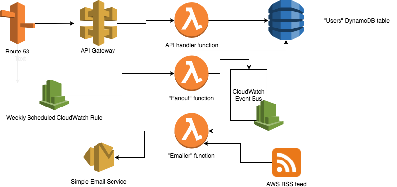

The AWS News architecture is "serverless" and comprises two main parts:

- A REST API that supports creating, reading, updating, and deleting users and their associated AWS services of interest
- A weekly scheduled workflow that retrieves the latest AWS news and emails relevant services updates to users

The AWS architecture looks like this:

Comments on individual architecture components follow.

### RSS Feed
The AWS What's NEW RSS feed contains a week's worth of product updates. Each update is tagged with the relevant product(s). We match these tags to user-selected services.

### Fanout function
The "fanout" AWS Lambda function scans the DynamoDB table and creates a separate CloudWatch event for each user. 

### Emailer function
The emailer function runs a separate invocation to handle each user event spawned by the fanout function, creating a custom email and sending it via AWS SES.

### REST API
All API routes go to a single Lambda function, which handles access to DynamoDB. Each user is stored in a single DynamoDB item, with their username as the hash key. The API does not require authentication.