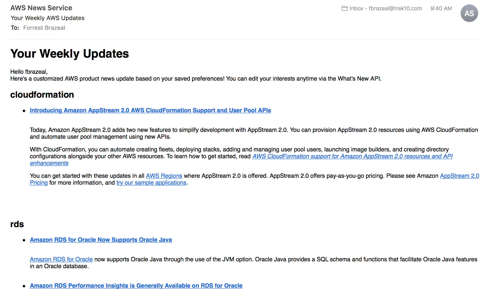

# Welcome to the AWS News API

This API allows you to subscribe to weekly email updates about specific AWS products and services. No more parsing through pages of irrelevant information! Just get updates on the services you care about.

## Quick Start

1. Create a user

`curl -XPOST https://[api-endpoint.com]/users -d '{"username":"[your username]","email":"[your email address]"}`

1. Add some services

`curl -XPUT https://[api-endpoint.com]/users/testuser/services -d '{"services":["rds","cloudformation"], "action":"ADD"'`

1. Check your email inbox at 0800 AM UTC+0 on Mondays. You'll get an email with content like this:

If there are no updates for your services, we won't send you an email for that week. Simple as that!

## Sources

Currently, all content comes from the [AWS What's New RSS feed](https://aws.amazon.com/new/feed/).
